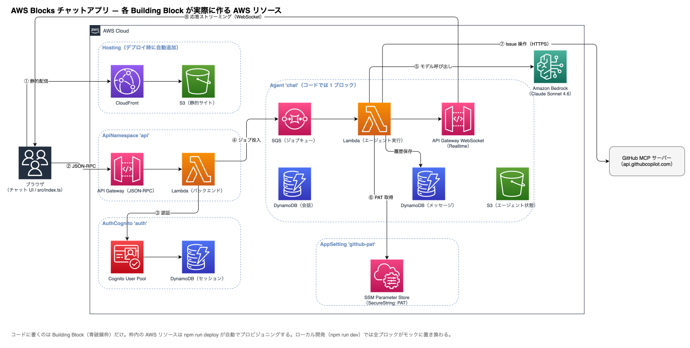

# AWS Blocks ハンズオン — AI エージェントへの指示だけで作る GitHub 連携 AI チャットアプリ

[AWS Blocks](https://www.npmjs.com/package/@aws-blocks/blocks) は「コードを書けばインフラがついてくる」Infrastructure-from-Code のフレームワークです。このハンズオンでは、**人間は原則コーディングせず、AI コーディングエージェント（Claude Code や Codex など）への指示（プロンプト）と定型コマンドだけ**で、次のアプリを作り上げます。

- Cognito 認証つきの AI チャットアプリ（Bedrock の Claude が応答）
- チャットから GitHub の Issue を操作できる MCP 連携（書き込みは人間の承認つき）
- ローカル（全モック・課金ゼロ）→ AWS への本番デプロイ → 後片付けまで一気通貫

> **このハンズオンの基準時点: 2026 年 7 月**。`@aws-blocks/blocks` **v0.2.1**（プレビュー版）で検証しています。AWS Blocks はプレビュー段階のため、正式版に向けて挙動・コマンド・API が変わる可能性があります。手順どおりに動かない場合は、まずバージョンの違いを疑ってください（それすらもエージェントに調べさせるのが、このハンズオン流です）。

## 完成形のアーキテクチャ



破線の枠が「コードに書く Building Block」、枠の中がそのブロックが自動でプロビジョニングする AWS リソースです。コードに登場するのは `AuthCognito` と `Agent` と `AppSetting` の 3 つだけ。Cognito・DynamoDB・Lambda・API Gateway（REST と WebSocket の 2 本）・SQS・S3 は、すべてブロックの裏側で勝手に生えてきます。

> **コラム: この図は誰が描いたか。** 実はこの図も、アプリ完成後に「裏でどんな AWS リソースができているか図にして」と Claude Code に指示して描かせたものです（draw.io 形式なので再編集もできます）。このハンズオンの最後まで来ると、この図の意味が全部わかるようになっています。

## ハンズオンのルール

1. **人間はコードを書きません。** コードの変更はすべて AI エージェントへのプロンプトで行います。本文中の 📝 プロンプト をそのまま（穴埋め部分だけ自分の値にして）貼り付けてください。
2. **定型コマンド（`npm run dev` や `npm run deploy` など）は人間が実行します。** 💻 マークのコマンドです。
3. プロンプトは一言一句同じでなくても構いません。エージェントの出力も毎回同じにはなりません——それ自体が AI 協働開発の体験の一部です。詰まったらエラーをそのままエージェントに貼るのが基本動作です。

> **NOTE:** このハンズオンの試走（動作検証）は **Claude Code でのみ実施**しています。Codex など他のエージェントでも同様に進められるはずですが、挙動や出力は検証していません。

## 0. 前提条件

- **Node.js 22.9 以上** と npm
- **AI コーディングエージェント**（Claude Code、Codex など）がインストール済みで使えること
- **AWS CLI** がインストール済みで、`aws login` で認証が通ること（本番デプロイと sandbox で使用）
- AWS アカウントで **Bedrock の Claude Sonnet 4.6 のモデルアクセスが有効**なこと（Bedrock コンソール → Model access）
- **GitHub アカウント**と、Issue を書き込んでよい実験用リポジトリ（第 3 章まで。自分のリポジトリなら何でも構いません）

> **NOTE: 料金について。** ローカル（第 1 章）は完全モックで課金ゼロです。第 2 章以降は Bedrock の従量課金と、デプロイ中のリソース費用がかかります（個人の試用ならごく小額の範囲）。最終章の `npm run destroy` で全リソースを片付けるところまでがハンズオンです。

## 1. 第一幕: チャットアプリを作る（ローカル・課金ゼロ）

### 1.1 プロジェクトを作る

💻 このリポジトリを clone した中（あるいは好きな場所）で:

```bash
npm create @aws-blocks/blocks-app@latest blocks-mcp-chat
cd blocks-mcp-chat
npm install
npm run dev
```

プロジェクト名（`blocks-mcp-chat`）は好きな名前に変えて構いません。ただし次の 1 点だけは守ってください。

> **WARNING: プロジェクト名を `aws` で始めないでください。** プロジェクト名はそのまま CloudFormation のスタック名の種（`.blocks/config.json` の `stackId`）になり、AWS のリソースグループは「AWS」始まりの名前を予約済みとして拒否します。しかもこの罠は**本番デプロイまで到達して初めて失敗する**遅発性です。（このハンズオンのリハーサルは `aws-blocks-sample-...` という名前で見事に踏みました）

http://localhost:3000 に Todo アプリの雛形が出れば成功です。この Todo はこれから跡形もなくなります。

### 1.2 チャットアプリに作り替える

💻 プロジェクトのディレクトリで AI エージェント（Claude Code なら `claude`）を起動し、以下を貼り付けます。

📝 **プロンプト 1**:

```text
サンプルの Todo アプリを削除して、AI チャットアプリに作り替えてください。要件は以下の通りです。

- 認証は AuthCognito を使う（サインアップ → 確認コード → サインイン）。
- チャット本体は Agent ブロックを使う。モデルはデプロイ時は BedrockModels.BALANCED、ローカルは canned モック（固定応答）でよい。
- UI は会話一覧のサイドバー、ストリーミング表示のチャット画面、New chat ボタン。
- 新規会話の名前が生の UUID のまま表示されないよう、見た目を整えること。
- ローカルのモック認証は確認コードをメール送信しない仕様なので、開発サーバーのターミナルに確認コードを出力するようにし、その旨を README にも書くこと。
- API ハンドラは必ず JSON 化可能な値を return すること（AWS Blocks のローカルサーバーは、戻り値のないハンドラだと 500 になる癖がある）。
- e2e テスト（test/e2e.test.ts）もチャットのドメインに書き換え、canned モックで決定的に通るようにすること。
- 秘密情報（トークンや .env の中身）は絶対にターミナルに表示しないこと。
- 完了したら npm run typecheck と npm run test:e2e が通ることを確認してください。
```

要件が長いと感じたかもしれません。これはリハーサル走で踏んだ落とし穴（確認コードが見えない、戻り値なしで 500、など）を先回りして織り込んであるためです。**AI への指示は、知っている地雷を全部書いておくほど一発で通ります。**

なお、こうした細かい指示が必要なのは、AWS Blocks がまだ**プレビュー段階**で成熟しきっていないことの裏返しでもあります。正式版に向けて改善されていけば、この要件リストはもっと短くて済むようになるはずです。

### 1.3 動かして確認する

💻 エージェントの作業が完了したら:

```bash
npm run dev
```

1. http://localhost:3000 でサインアップする（メールアドレスは実在しなくてよい）
2. 確認コードは**メールでは届きません**。`npm run dev` のターミナルに `[auth] verification code for ...` と出力されるので、それを入力
3. サインインしてチャットに何か送ると、`This is a canned mock response...` のような**固定応答**が返ります

固定応答なのは意図した挙動です。ローカルでは LLM も認証もすべてモックで動いており、AWS アカウントも API キーも一切使っていません。ここまで課金ゼロです。

## 2. いきなり本番デプロイする

モックのままでは味気ないので、もう本番に出しましょう。コードは 1 行も変えません。

💻 `aws login` が通っている状態で:

```bash
npm run deploy
```

10 分ほどかかります。完了すると 2 つの URL が表示されます:

```
✅ Deployment complete!
📡 API URL:      https://xxxx.execute-api.ap-northeast-1.amazonaws.com/prod/aws-blocks/api
🌐 Frontend URL: https://xxxx.cloudfront.net
```

Frontend URL を開いてサインアップしてください。**本番では確認コードは実際にメールで届きます**（ローカルと違いターミナルには出ません）。チャットに送信すると、今度は固定応答ではなく **Bedrock の Claude Sonnet 4.6** が答えます。

コマンド 1 発で、Cognito・DynamoDB・Lambda・API Gateway × 2・SQS・S3・CloudFront が立ち上がりました。冒頭のアーキテクチャ図を見返してみてください——あなたはこれらのサービスを 1 つも設定していません。

> **NOTE:** この時点の公開 URL は誰でもサインアップできる状態です。第 4 章で閉じますので、URL をむやみに共有しないでください。

## 3. 第二幕: チャットから GitHub を操作する（MCP 連携）

次は、このチャットに GitHub の Issue を操作させます。AI に実世界への書き込みをさせるので、**書き込み前に人間が承認するフロー**も一緒に作ります。

### 3.1 MCP 連携を実装させる

📝 **プロンプト 2**（`<あなたのユーザー名>/<実験用リポジトリ名>` を自分の値に置き換えてください）:

```text
このチャットアプリから GitHub を操作できるようにしてください。要件は以下の通りです。

- GitHub 公式のリモート MCP サーバー（https://api.githubcopilot.com/mcp/）に、エージェントのツールのハンドラ内から PAT 認証で接続する（静的プロキシ方式）。
- 対象リポジトリは <あなたのユーザー名>/<実験用リポジトリ名> に固定でよい（コードに定数で書く）。
- Issue の操作を一通り用意する: 検索・取得・コメント一覧は承認不要、作成・更新・クローズ・再オープン・コメント追加は needsApproval で人間の承認を必須にする。
- 承認 UI: ツール名と引数を表示して Approve / Deny できるカードをチャット画面に出すこと。ページをリロードしても承認待ちに復帰できること。
- PAT は秘密情報として扱う: ローカルは .env の GITHUB_PAT（.env は gitignore し、.env.example をコミット）、AWS 側は AppSetting(secret) の SSM SecureString パラメータ。.env の値を sandbox / 本番の SSM に反映する npm run pat:push:sandbox / npm run pat:push:prod スクリプトも作ること。
- 注意: リモート MCP サーバーのツール名は予告なく変わることがある。実装前に tools/list で実際のツール名とスキーマを照会してから書くこと。照会用ユーティリティも npm run mcp:tools として残すこと。
- 秘密情報（PAT や .env の中身）は絶対にターミナルに表示しないこと。
- e2e テストに「承認要求 → 拒否 → 外部通信なしで完了」の拒否パスを追加すること。npm run typecheck と npm run test:e2e が通ることを確認してください。
```

ここでのポイントは**秘密と設定の区別**です。リポジトリ名は秘密ではないのでコードに直書きで構いません。PAT は秘密なので `.env`（ローカル）と SSM SecureString（AWS）に置き、コードにもチャットにも書きません。

### 3.2 GitHub PAT を発行して設定する

実装ができたので、PAT の置き場所（`.env.example`）ができました。ここで初めて PAT を発行します。GitHub の Settings → Developer settings → **Fine-grained personal access tokens** で:

- **Repository access**: 実験用リポジトリ 1 つだけに限定
- **Permissions**: Issues の Read and write（+ Metadata: Read-only は自動で付きます）

発行したトークンは `.env` だけに書きます。**チャット欄や設定ファイル以外の場所に貼らないこと。**

💻 `.env` に PAT を設定してローカルで動作確認します:

```bash
cp .env.example .env   # GITHUB_PAT=... を書き込む
npm run dev
```

チャットで「`<リポジトリ名>` の issue を検索して」などと話しかけてみてください。ローカルはモック LLM なので会話は不自然ですが、ツール呼び出しと**承認カード**（書き込み系のとき）の動きが確認できます。

### 3.3 sandbox で「本物の AI × 本物の GitHub」を試す

ローカルのモック LLM では MCP 連携の本当の面白さはわかりません。かといって毎回フルデプロイは重い。そこで **sandbox** です——バックエンドだけ AWS に上げ、画面はローカル配信のまま、本物の Bedrock と本物の GitHub で動かす開発用環境です。

💻:

```bash
npm run sandbox          # バックエンドを AWS へ → そのままローカルサーバーが起動する
```

別のターミナルで:

```bash
npm run pat:push:sandbox   # .env の PAT を sandbox の SSM パラメータへ反映
```

http://localhost:3000 でサインアップし（sandbox の確認コードは実メールで届きます）、チャットで頼んでみてください:

```text
「AWS Blocks ハンズオンの動作確認」というタイトルで issue を立ててください。本文は「ハンズオンで作ったチャットアプリからの投稿テストです。確認が済んだらクローズします。」でお願いします。
```

Claude が issue の下書きを作り、承認カードが出て、**Approve を押すと本当に GitHub に issue が立ちます**。検索や取得は承認なしで即実行されるのに、書き込みだけ止まる——この非対称が needsApproval の設計です。

> **TIP: `unknown tool` エラーが出たら。** リモート MCP サーバーのツール名は実際に改編されることがあります（リハーサル中に `create_issue` が `issue_write` に変わっていました）。`npm run mcp:tools` で現物のツール一覧を照会し、その結果をエージェントに貼って直させてください。

## 4. 第三幕: 使って気づいたことを直させる

ここからが AI 協働開発の日常です。**触って、気づいて、指示する。**

### 4.1 日本語入力の Enter 問題

チャット欄に日本語を打ってみてください。変換確定の Enter で——送信されてしまいませんか？

📝 **プロンプト 3**:

```text
チャットの入力欄で、日本語入力の変換確定の Enter を押すとメッセージがそのまま送信されてしまいます。変換確定の Enter では送信しないように直してください。
```

エージェントは `isComposing` を使った定番の対策を入れてくれるはずです。直ったかどうかは自動テストでは確認しづらいので、ブラウザで自分の指で確かめてください。

### 4.2 サインアップを閉じる

第 2 章の最後で予告した件です。今の本番 URL は、知っている人なら誰でもサインアップして、**あなたの Bedrock 課金でチャットし、あなたの PAT で GitHub を操作**できてしまいます。

📝 **プロンプト 4**:

```text
本番の URL を知っている人は誰でもサインアップして、私の Bedrock 課金と GitHub PAT でこのアプリを使えてしまいますよね？ サインアップを閉じることはできますか？ できるなら閉じてください。
```

`AuthCognito` の `selfSignUp: false` 1 行で閉じられます（以後のユーザー作成は管理者経由のみ。作成済みの自分のアカウントはそのまま使えます）。

### 4.3 片付けの準備も指示しておく

もう 1 つ、このあとの後片付けのための指示を先に出しておきます。AWS Blocks の既定では、本番の DynamoDB や S3 は誤削除保護のため destroy しても**保持**されます。堅牢で正しい既定ですが、ハンズオンでは残骸が邪魔になります（残骸があると再デプロイが `already exists` で衝突します）。

📝 **プロンプト 5**:

```text
このアプリは検証用なので、npm run destroy で本番のデータ込みの全リソース（DynamoDB テーブルや S3 バケットも）を削除できるようにしてください。AWS Blocks の既定では本番のデータを持つリソースは保持される点、S3 バケットは空でないと削除できない点を考慮すること。実運用では既定に戻すべきである旨をコードコメントに残してください。
```

> **NOTE:** この変更（removal policy）は**次のデプロイでスタックに焼き込まれて初めて効きます**。だからこのタイミング——最後の本番更新の前——で指示しています。

## 5. 本番を更新して完成

幕 3 の改善をすべて本番に反映します。更新も初回とまったく同じコマンド 1 発です。

💻:

```bash
npm run deploy
npm run pat:push:prod    # .env の PAT を本番の SSM パラメータへ反映
```

Frontend URL を開いて最終確認です。日本語入力は快適に、サインアップ画面は閉じられ、そしてチャットから GitHub の issue が operate できる、あなたの AI チャットアプリの完成です。

> **コラム: sandbox と本番で SSM パラメータが別なのはなぜ？** AWS Blocks はスタック名を含めてパラメータ名を導出するため、sandbox と本番の秘密は自動的に別物になります。`pat:push:sandbox` / `pat:push:prod` が分かれているのはこのためです。環境ごとに秘密を分けるのは実運用でもそのまま通用する作法です。

## 6. 後片付け

💻 遊び終わったら:

```bash
npm run destroy            # 本番の全リソースを削除（データ込み）
npm run sandbox:destroy    # sandbox も忘れずに
```

数分で、この 1 時間のあいだ存在した Cognito も DynamoDB も Lambda も CloudFront も、跡形もなく消えます。**作るのも 1 コマンド、消すのも 1 コマンド**——これが「試す→消す→もう一度」を恐れなくてよい、Infrastructure-from-Code の身軽さです。

## 完成形サンプル

実際にこのハンズオンを走らせた完成形を [`sample/`](./sample/) に置いています（準備中: 試走のたびに更新されます）。プロンプトの出力は毎回同じにはならないので、あなたの結果と違っていて当然です。困ったときの参照実装としてお使いください。

## 発展: もっと遊びたい人へ

- **ローカルでも本物の LLM を使いたい**: [Ollama](https://ollama.com) を入れて軽量モデル（例: IBM の `granite4:micro`、日本語のツール呼び出しが実用になる 2GB 級）を動かすと、`npm run dev` でも実 LLM が使えます。設定方法は `sample/` の README を参照。ただし軽量ローカル LLM での MCP 連携はモデルの当たり外れが激しく、上級者向けです。
- **裏側を覗きたい**: エージェントに「このアプリが AWS に何を作っているのか図にして」と頼んでみてください。冒頭の図の誕生と同じ体験ができます。

## フィードバック

このハンズオンは「実際に試した結果で改善する」方式で育てています。詰まった箇所・分かりにくい箇所は、ぜひこのリポジトリの [Issues](https://github.com/k-ibaraki/handson-aws-blocks/issues) へ。……もちろん、**ハンズオンで作ったチャットアプリから issue を立てて**いただいても構いません。それが一番の完走報告です。
